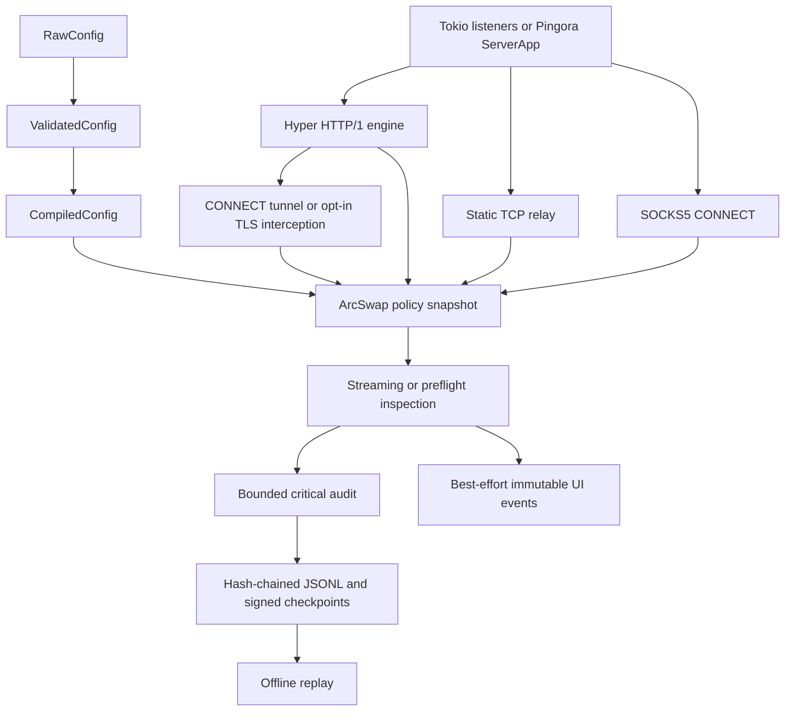
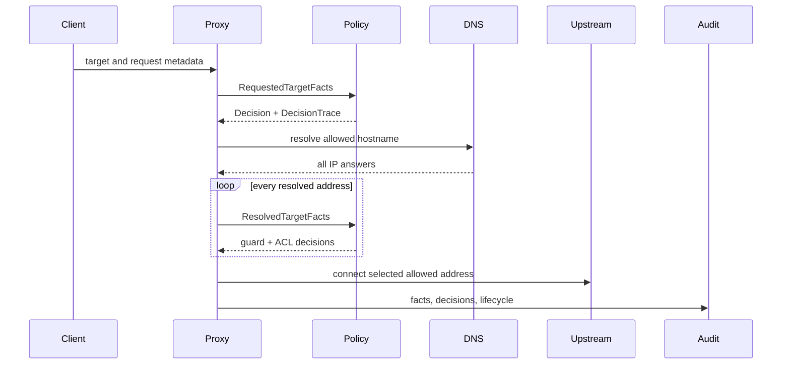

Freja separates protocol-independent security decisions from runtime and wire
mechanics. Pingora types exist only in its adapter; domain, configuration,
policy, inspection, audit, hooks, and UI do not depend on them.

## Crate boundaries

### `freja-domain`

Owns validated identifiers, endpoints, runtime modes, narrowly shaped facts,
findings, decisions, traces, and listener specifications. Every connection has
a `SessionId`; every HTTP exchange has a `TransactionId`. It has no async
runtime, parser, or Pingora dependency.

### `freja-config`

Owns the only configuration compiler. The typestate path rejects invalid mode
combinations, zero bounds, unsafe remote exposure, unbounded capture, malformed
credential digests, empty CONNECT/interception allowlists, and invalid policy
or detector inputs before sockets open.

### `freja-policy`

Evaluates declaration-ordered first-match ACLs. Requested destinations are
checked before DNS; destination guards and ACLs then evaluate every address.
Detectors emit `Finding`; inspection policy converts findings into traced
decisions. Fixed-pattern scanners retain bounded overlap across chunks. Typed
automatic and interactive hooks live here without wire access.

### `freja-audit`

Serializes typed version-1 events after central redaction. Its bounded channel
and explicit fail-open/fail-closed behavior are independent from UI delivery.
Each record links to its predecessor; optional periodic Ed25519 checkpoints
authenticate retained positions when their public key is pinned externally.

### `freja-proxy`

Owns transport behavior. Hyper handles HTTP/1 absolute-form and CONNECT. Freja
regenerates `Host`, removes hop-by-hop headers, rejects ambiguous framing, and
streams bodies. CONNECT policy and upstream connection finish before the 200
response commits. Static TCP and SOCKS5 share destination authorization,
bounded relay, inspection, hooks, audit, metrics, and shutdown.

TLS interception is hostname-opted. It establishes upstream TCP before CONNECT
commitment, negotiates downstream TLS, and authenticates upstream TLS with the
selected `h2` or `http/1.1` ALPN. Rcgen creates SAN-bearing leaves from a
protected CA; a bounded host-plus-ALPN cache stores server configurations.
Hyper decodes intercepted HTTP/1.1 and HTTP/2 and reconnects their semantic
exchanges to the same bounded HTTP policy, inspection, typed-hook, audit, and
replay pipeline.

### `freja-ui`

Consumes immutable snapshots and owns the terminal on an isolated thread behind
an RAII restoration guard. In TUI mode the CLI formats operational tracing as
bounded immutable UI events, so no concurrent writer touches the raw terminal.
UI saturation drops snapshots or log lines and increments a metric. Interactive
requests use a separate bounded channel, paused-flow semaphore, timeout, and
oneshot response.

### `freja`

Is the bootstrap and error-erasure boundary. It starts multiple listener kinds,
owns signals and the audit writer, performs compatible SIGHUP reloads, and
verifies/replays stored input. It selects the normal terminal tracing writer or
the bounded TUI router before listener startup and disconnects that router
before joining the terminal thread. The production multi-listener runtime uses
Tokio; the generic Pingora 0.8.1 `ServerApp` adapter remains compile-tested.

## Decision flow

HTTP request/response facts and inspection findings add further policy stages,
but they never bypass requested/resolved authorization.

## Reload state

One immutable snapshot contains ACL, destination guard, enforcement mode,
inspection program, inspection mode, and policy generation. A compatible SIGHUP
candidate is fully parsed, validated, and compiled before one `ArcSwap` replaces
that snapshot. Existing tasks see either the old or new snapshot, never a mix of
fields. Resource-owning configuration remains restart-only.

## Core invariants

- Every selected DNS address is authorized; each detour or newly selected
  destination re-enters the same checks.
- No HTTP response is emitted after CONNECT tunnel commitment.
- Body mutation operates on decoded-body types and rebuilds framing.
- Forwarding never waits for UI publication; critical audit failure is never
  silently ignored.
- Payload capture, hooks, TLS interception, and remote exposure are opt-ins.
- Connections, headers, body prefixes, caches, header/body reads, upstream
  connects, relay inactivity, paused flows, and channels are bounded.
- Library crates forbid unsafe code and expose concrete error enums.
