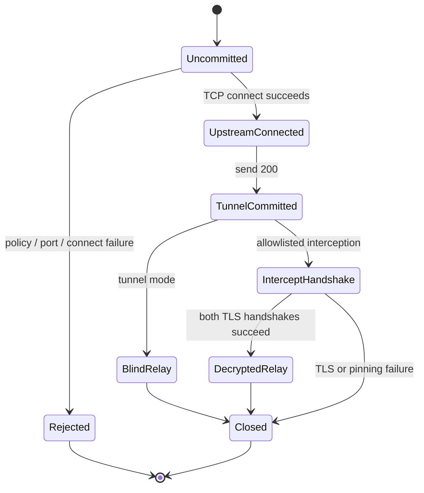

The listener runtime is replaceable. Protocol semantics and security decisions
must not change when the transport adapter changes.

## Runtime adapters

`ListenerEngine` exposes only an `EngineKind`. The shipped CLI uses Tokio
listeners because it coordinates HTTP, static TCP, and SOCKS5 listeners with
Freja-specific metadata, limits, shutdown, TUI, and audit resources.

The `pingora-adapter` feature compiles a concrete Pingora 0.8.1 `ServerApp`.
Its `process_new` callback hands one `Stream` to a narrow
`PingoraConnectionHandler`, awaits ownership completion, and returns `None` so
the consumed transport never enters Pingora's reuse loop. No policy or protocol
rule lives in this module.

Do not introduce Pingora types into `freja-domain`, `freja-config`,
`freja-policy`, `freja-audit`, or `freja-ui`. Do not use
`pingora-proxy::ProxyHttp` for explicit forward-proxy parsing.

## HTTP ownership

Hyper 1.x owns the HTTP/1 connection state machine. A downstream connection is
served with upgrades enabled so CONNECT can transfer ownership to the tunnel
task. Freja code owns:

- absolute-form target validation and origin-form regeneration;
- `Host` regeneration from the request target;
- framing and hop-by-hop policy around Hyper's parsed headers;
- destination authorization and upstream client connection;
- synthetic errors before commitment;
- streaming body inspection and typed mutation.

This keeps malformed wire parsing in a maintained HTTP implementation while
making proxy-specific invariants explicit.

## CONNECT commitment

After `TunnelCommitted`, an HTTP block or redirect is illegal. Failures close
and audit the tunnel. Tunnel tasks are tracked so graceful shutdown can signal
and drain them.

## Relay ownership

Static TCP, SOCKS5, blind CONNECT, and decrypted TLS relay use bounded
directional processing. Each direction owns scanner and hook state, applies
idle timeout, counts bytes, and observes shutdown. TCP preflight holds no more
than the configured prefix and releases a benign short prefix after the
configured read timeout; streaming cannot retract bytes already sent.

When adding a listener, reuse the destination authorization and relay
boundaries. Do not create a path that selects one DNS answer before all answers
have been policy checked.

See [ADR 0001](/developer/adr/0001-engine-boundary/),
[ADR 0002](/developer/adr/0002-pingora-server-app/), and
[ADR 0003](/developer/adr/0003-forward-proxy-http-engine/).
