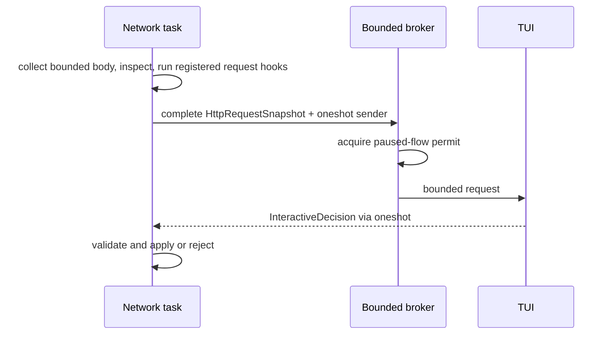

Hooks remain in `freja-policy::hook` while the API stabilizes. The application
default uses the bounded interactive broker; the headless profile disables
hooks. There is no native dynamic-library loading path.

## Stage contracts

Automatic hooks register in-process for six distinct stages:

- HTTP request head;
- decoded HTTP request body;
- HTTP response head;
- decoded HTTP response body;
- TCP client-to-upstream chunk;
- TCP upstream-to-client chunk.

Keeping interfaces stage-specific prevents one context struct filled with
invalid `Option` combinations. Hook context contains copied identity and bounded
snapshots, never references to live network sessions.

HTTP head hooks return `HeadMutationPlan`; body hooks return
`BodyMutationPlan`; TCP hooks return bounded chunk transformations. Mutation
validation rejects hop-by-hop fields and proxy-controlled `Content-Length`.
The HTTP engine is solely responsible for wire framing and recalculates
`Content-Length` after decoded-body replacement.
Wire and decoded body representations remain separate types. Automatic and
interactive replacements larger than `limits.body_prefix_bytes` are rejected
at the shared data-plane boundary; TCP chunk replacements use the same bound.
A decoded replacement removes stale content
encoding and representation validators in preflight mode; streaming body hooks
reject content-encoded messages because their heads are already committed.

## Execution and failure

`HookRunner` applies the runtime mode, invokes a matching registered hook, and
enforces the configured timeout. A concrete `HookError` remains visible inside
the policy/proxy layers. Fail-open or fail-closed behavior is an explicit runner
choice; the CLI currently selects fail-closed.

The shipped CLI intentionally uses an empty registry. Embedders construct a
registry and pass the runner through `DataPlaneServices`; configuration does not
discover executable code.

## Interactive HTTP request state

The queue capacity and paused-flow semaphore are independent. Saturation,
closed channels, timeout, and a dropped responder are distinct errors. Each
HTTP request pauses once before upstream forwarding. Its snapshot contains the
parsed method, URI, headers, and complete body bounded by
`limits.body_prefix_bytes`; method, URI, version, headers, and body are copied
through the reliable pause channel so the request remains operable even if a
best-effort UI event was dropped. An oversized body receives 413 instead of pausing.
CONNECT pauses once with an empty body before commitment. The decision is one
of Continue, Reject, EditHeaders, ReplaceBody, ModifyRequest, or
CancelModification. `ModifyRequest` combines a `HeadMutationPlan` and
`BodyMutationPlan` so the TUI can submit one atomic edit; granular variants
remain available to embedders.

HTTP responses remain visible to the TUI but are never paused. TCP traffic is
also observe-only at the interactive broker boundary; it does not acquire a
paused-flow permit or wait for an operator. Registered typed response/TCP hooks
remain an in-process embedding mechanism, while manual TCP drop/mutation is
deferred. The TUI parses an HTTP/1.1 text draft into typed header/body changes;
it does not emit wire bytes. Manual HTTP edits are bounded and audited by action without content.
Reject is legal only before protocol commitment; after CONNECT commitment the
system cannot synthesize another HTTP response.

## Extension policy

Do not load Rust dynamic libraries: Rust has no stable plugin ABI, and native
code would bypass Freja's memory and capability boundary. If an external plugin
model is introduced, design a separately reviewed WASM boundary with explicit
capabilities, time, memory, and execution budgets. Do not publish a hook SDK
until these in-process contracts stabilize.
