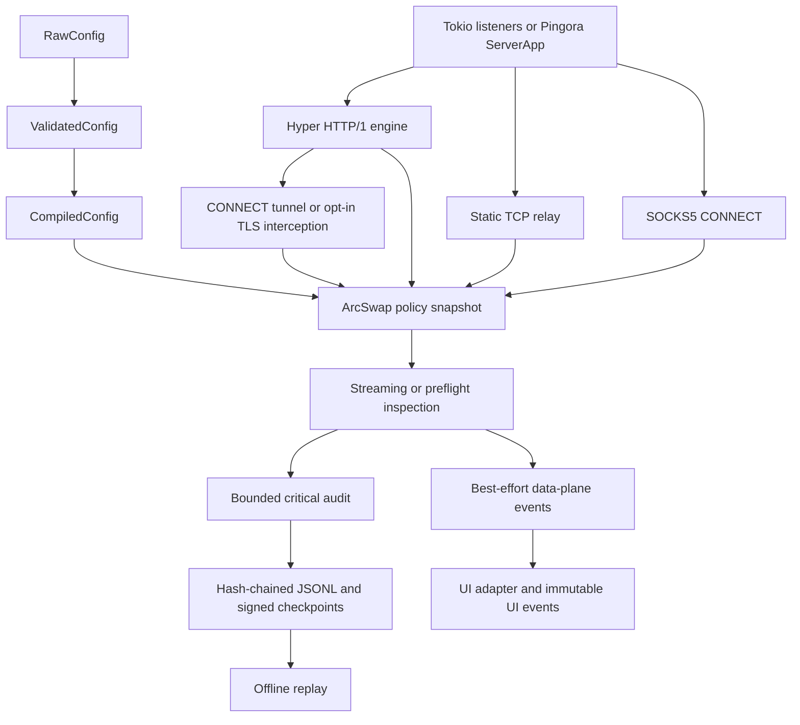
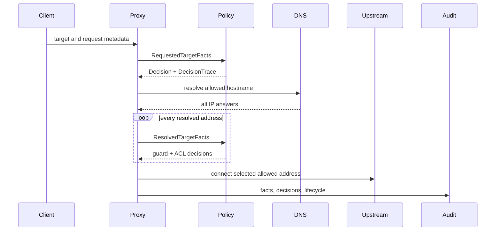

Frejaはframework非依存のsecurity decisionをruntime/wire処理から分離します。protocol固有のfact/actionはdomain modelに含めますが、wire parserやconcrete networking runtimeからは独立させます。Pingora型はadapterだけに存在し、domain、configuration、policy、inspection、audit、Hook、UIは依存しません。

## Crate境界

### `freja-domain`

validated identifier、endpoint、runtime mode、目的別fact、finding、decision、trace、listener specificationを所有します。全connectionは`SessionId`、全HTTP exchangeは`TransactionId`を持ちます。async runtime、parser、Pingoraには依存しません。

### `freja-config`

唯一のconfiguration compilerです。typestate pathにより、socketを開く前に不正なmode組み合わせ、zero bound、安全でないremote exposure、無制限capture、不正credential digest、empty CONNECT/interception allowlist、不正policy/detectorを拒否します。

内部では`raw`がSerde向けTOML model、`validation`がsemantic/cross-field invariant、`compiled`がimmutableなpolicy/inspection programの構築を所有します。listener、resource limit、audit、inspection、TLSのruleは各stage内の担当moduleへ分離し、crate rootはstableなpublic APIだけを公開します。commandless/config-free startupでは`freja` composition rootが`RawConfig::default()`へloopback HTTP listener 1件を追加し、socketを開く前に完全なcompilerを通します。`freja-config`自体はlistenerを暗黙生成しません。

### `freja-policy`

宣言順first-match ACLを評価します。requested destinationをDNS前に確認し、その後destination guardとACLが全addressを評価します。detectorは`Finding`を生成し、inspection policyがtraced decisionへ変換します。fixed-pattern scannerはchunk間のbounded overlapを保持します。typed automatic/interactive Hookもwire accessなしでここに置きます。

### `freja-audit`

central redaction後にtyped version-1 eventをserializeします。bounded channelと明示的fail-open/fail-closedはUI deliveryから独立しています。各recordは直前recordへlinkし、optional Ed25519 checkpointは外部pinされたkeyにより保持位置をauthenticateします。

### `freja-proxy`

transport behaviorを所有します。HyperがHTTP/1 absolute-formとCONNECTを処理し、Frejaが`Host`再生成、hop-by-hop除去、ambiguous framing拒否、body streamingを担います。CONNECT policyとupstream接続は200 commit前に完了します。static TCPとSOCKS5はdestination authorization、bounded relay、inspection、Hook、audit、metrics、shutdownを共有します。

public listener constructorはproxy所有の`ProxyLimits`を受け取り、TLS/capture setupもproxy所有のvalidated inputを使います。`freja-config`の値は`freja` composition rootで変換し、configuration/UI型をdata-plane crateへ漏らしません。

TUIがattachedの場合に限り、proxy所有の`UiCaptureSettings`がplain explicit HTTP/1 streamへnon-blocking ingress observerを設置します。protocol parse/forwardingの正はHyperです。privateで上限付きのcapture-only framerは、content-length、chunked trailer、informational response、close-delimited responseを含むmessage境界を検出し、正確なRaw表示だけに使います。結果はbest-effort UI eventしか生成できず、trafficのaccept/reject/mutation/delayには影響できません。third-party HTTP wire-capture dependencyと汎用public parser APIは追加しません。

TLS interceptionはhostname単位のopt-inです。CONNECT commit前にupstream TCPを確立し、downstream TLSをnegotiateして、選択された`h2`/`http/1.1` ALPNでupstream TLSを認証します。Rcgenはprotected CAからSAN付きleafを作り、host+ALPNのbounded cacheへ保存します。Hyperがintercepted HTTP/1.1/HTTP/2をdecodeし、semantic exchangeを同じ上限付きHTTP policy、inspection、typed Hook、audit、replay pipelineへ再接続します。
TUIはこれらintercepted exchangeをsemantic表示します。persistent intercepted HTTP/1とHTTP/2 framingの正確なRaw captureは、transaction correlationを専用設計するまで意図的にunavailableです。

### `freja-ui`

immutable snapshotを受け、isolated threadでRAII restoration guardのもとterminalを所有します。TUI modeではCLIがoperational tracingをbounded immutable UI eventへformatするため、raw terminalへ同時に書くproducerはありません。UI saturationはsnapshotまたはlog lineをdropしてmetricを増やします。interactive requestは別のbounded channel、paused-flow semaphore、timeout、oneshot responseを使います。
traffic rowは設定でboundedです。screen 1はHTTPを`TransactionId`、TCPを`SessionId`でcorrelateし、screen 2はevidence/log/statisticsを分離します。HTTP interactive modeはcompleteでboundedなrequest snapshotをoperatorへ1回送ります。HTTP/1.1 text editorはそのcopy済みsnapshotだけを所有し、validate済みdraftを原子的な型付きheader/body planへ変換します。method、target、version、routing、framingはdata planeの責務のままです。responseとTCP dataはTUI decisionを待ちません。

### `freja`

bootstrap/error-erasure境界です。複数listener、signal、audit writer、compatible SIGHUP reload、stored inputのverify/replayを所有します。compiled configurationをsubsystem所有runtime inputへ変換し、UI非依存data-plane eventを現在のpresentationへadaptします。listener起動前に通常terminal tracing writerまたはbounded TUI routerを選び、terminal threadをjoinする前にrouterを切断します。production multi-listener runtimeはTokioを使い、generic Pingora 0.8.1 `ServerApp` adapterもcompile-testします。

## Decision flow

HTTP request/response factとinspection findingは追加policy stageになりますが、requested/resolved authorizationを迂回しません。

## Reload state

1 immutable snapshotがACL、destination guard、enforcement mode、inspection program/mode、policy generationを保持します。compatible SIGHUP candidateはparse、validate、compile完了後に1回の`ArcSwap`で置換します。taskは旧snapshotか新snapshotのどちらかを見て、fieldの混在はありません。resourceを所有する設定はrestart-onlyです。

## Core invariant

- 選択する全DNS addressをauthorizeし、detour/new destinationも同じ検査へ戻す
- CONNECT tunnel commit後にHTTP responseを出さない
- body mutationはdecoded-body typeへ適用しframingを再構築する
- forwardingはUI publicationを待たず、critical audit failureを黙殺しない
- default runtimeはTui + Enforce + Interactive、標準headless profileはHeadless + Enforce + Disabled。各choiceは独立
- payload capture、TLS interception、remote exposureはopt-in
- connection、header、body prefix、cache、header/body read、upstream connect、relay無通信、paused flow、channelはbounded
- library crateはunsafeを禁止し、concrete error enumを公開する
