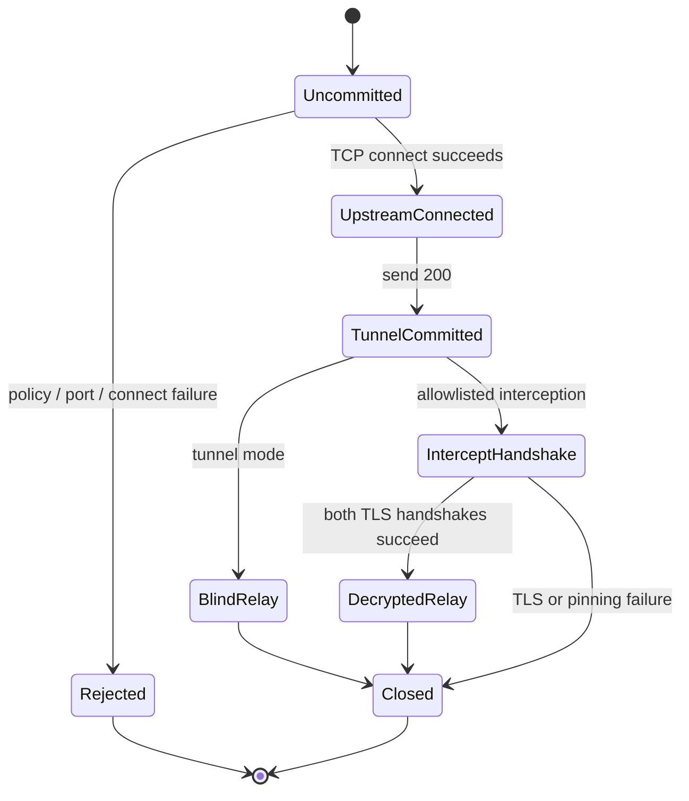

protocol semanticsとsecurity decisionはframework非依存です。runtime lifecycle実装は隔離しますが、現時点では1つのlistener trait背後で交換可能とはしません。

## Runtime adapter

同梱CLIはFreja固有metadata、limit、shutdown、TUI、audit resourceを使ってHTTP、static TCP、SOCKS5を協調するためconcrete Tokio listenerを直接所有します。accept loopは`freja-proxy`内にあり、proxy固有runtime settingだけを受け取ります。

`pingora-adapter` featureはPingora 0.8.1のconcrete `ServerApp`をcompileします。`process_new` callbackは1つの`Stream`を狭い`PingoraConnectionHandler`へ渡し、ownership完了をawaitし、消費済みtransportがPingora reuse loopへ戻らないよう`None`を返します。このmoduleにpolicy/protocol ruleは置きません。

TokioとPingoraではservice/process lifecycleが異なるためentry pointを分けます。両runtimeにprotocol behaviorと型隔離を超える実証済みの共通操作が必要になった時だけ、共通抽象を追加します。

`freja-domain`、`freja-config`、`freja-policy`、`freja-audit`、`freja-ui`へPingora型を導入してはいけません。explicit forward proxyに`pingora-proxy::ProxyHttp`を使いません。

## HTTP ownership

Hyper 1.xがHTTP/1 connection state machineを所有します。downstream connectionはupgrade有効でserveし、CONNECTがtunnel taskへownershipを渡せるようにします。Freja codeは次を所有します。

- absolute-form target validationとorigin-form再生成
- request targetからの`Host`再生成
- parsed headerに対するframing/hop-by-hop policy
- destination authorizationとupstream client connection
- commit前のsynthetic error
- streaming body inspectionとtyped mutation

malformed wire parsingを保守されたHTTP実装へ任せながら、proxy固有invariantを明示できます。

## CONNECT commitment

`TunnelCommitted`後のHTTP block/redirectは不正です。failureはtunnelをcloseしてauditします。tunnel taskをtrackし、graceful shutdownでsignal/drainします。

## Relay ownership

static TCP、SOCKS5、blind CONNECT、decrypted TLS relayはbounded directional processingを共有します。各directionはscanner/Hook stateを所有し、idle timeout、byte count、shutdownを適用します。TCP preflightが保持するのは設定prefixまでで、benignな短いprefixは設定read timeout後に解放します。streamingは送信済みbyteを取り消せません。

listener追加時はdestination authorizationとrelay境界を再利用し、全DNS answerのpolicy確認前に1 addressを選択するpathを作らないでください。

[ADR 0001](/ja/developer/adr/0001-engine-boundary/)、[ADR 0002](/ja/developer/adr/0002-pingora-server-app/)、[ADR 0003](/ja/developer/adr/0003-forward-proxy-http-engine/)も参照してください。
