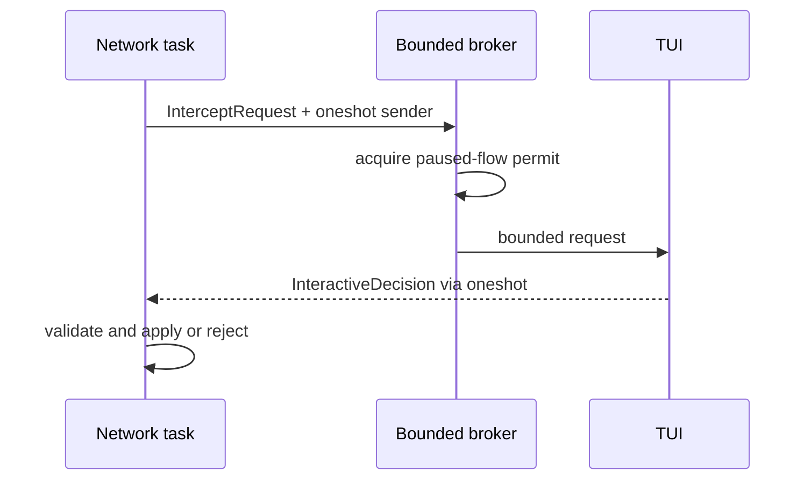

APIが安定するまでHookは`freja-policy::hook`に置きます。defaultはdisabledで、native dynamic-library loading pathはありません。

## Stage contract

automatic Hookは6つの個別stageへin-process登録します。

- HTTP request head
- decoded HTTP request body
- HTTP response head
- decoded HTTP response body
- TCP client-to-upstream chunk
- TCP upstream-to-client chunk

interfaceをstage別にすることで、不正な`Option`組み合わせを持つ1つのcontext structを避けます。Hook contextはcopy済みidentityとbounded snapshotを持ち、live network sessionへのreferenceは持ちません。

HTTP head Hookは`HeadMutationPlan`、body Hookは`BodyMutationPlan`、TCP Hookはbounded chunk transformを返します。mutation validationはhop-by-hop fieldとproxy管理の`Content-Length`を拒否します。wire framingはHTTP engineだけが担い、decoded-body置換後に`Content-Length`を再計算します。wire/decoded bodyは別typeです。automatic/interactive置換とTCP chunk置換が`limits.body_prefix_bytes`を超える場合は共通data-plane境界で拒否します。preflightのdecoded置換では古いcontent encoding/validatorを除去し、head commit後に安全な修正ができないためstreaming body Hookはcontent-encoded messageを拒否します。

## 実行とfailure

`HookRunner`はruntime modeを適用し、一致するregistered Hookを呼び、timeoutを強制します。concrete `HookError`はpolicy/proxy layer内で保持します。fail-open/fail-closedはrunnerの明示choiceで、CLIはfail-closedを選びます。

同梱CLIは意図的にempty registryを使います。embedderがregistryを構築し、runnerを`DataPlaneServices`へ渡します。configurationからexecutable codeをdiscoverしません。

## Interactive state

queue capacityとpaused-flow semaphoreは独立です。saturation、closed channel、timeout、dropped responderは別errorです。decisionはContinue、Reject、EditHeaders、ReplaceBody、CancelModificationのいずれかです。

manual editはboundedで、contentではなくactionをauditします。Rejectはprotocol commit前だけ有効です。interactive TCP rejectはflowをcloseし、CONNECT commit後に別HTTP responseは生成できません。

## 拡張policy

Rust dynamic libraryをloadしません。Rustにはstable plugin ABIがなく、native codeはFrejaのmemory/capability境界を迂回します。external pluginを導入する場合は、明示capability、time、memory、execution budgetを持つWASM境界を別途reviewします。in-process contractが安定するまでhook SDKを公開しません。
